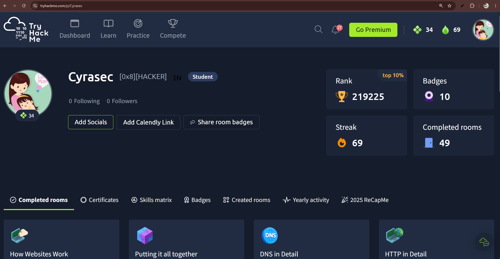
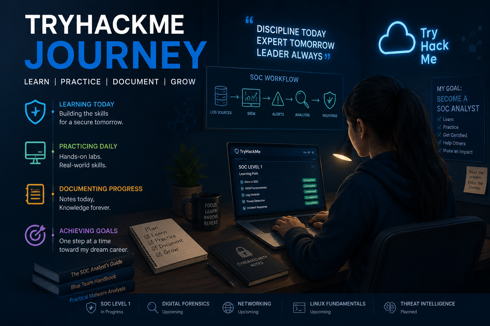

## 🔗 TryHackMe Profile

Profile: https://tryhackme.com/p/Cyrasec



---

## 🚀 Learning Journey Snapshot



---

# 🛡️ TryHackMe Cybersecurity Journey

## About

This repository documents my cybersecurity learning journey on TryHackMe.

I am an AIML graduate and aspiring SOC Analyst, actively building practical skills through hands-on labs, security challenges, and self-study.

The purpose of this repository is to track my progress, document key concepts learned, and showcase my cybersecurity learning path.

---

## 🎯 Career Goal

Aspiring SOC Analyst (Blue Team)

Interested in:

- Security Operations Center (SOC)
- SIEM & Log Analysis
- Threat Detection
- Incident Response
- Digital Forensics
- Network Security
- Linux Administration
- Cyber Threat Intelligence

---

## 📚 Learning Paths

### SOC Level 1
- Junior Security Analyst Intro
- SOC Role in Blue Team
- Introduction to SIEM
- Humans as Attack Vectors
- Systems as Attack Vectors

### Digital Forensics
- Intro to Digital Forensics
- Evidence Collection
- File Analysis

### Networking Fundamentals
- OSI Model
- TCP/IP
- DNS
- HTTP/HTTPS

### Linux Fundamentals
- Linux Commands
- File Permissions
- User Management

---

## 🎯 Future Goals

- Complete TryHackMe SOC Level 1 Path
- Improve SIEM and Log Analysis Skills
- Learn Incident Response and Threat Hunting
- Complete More Blue Team Labs
- Build Security Monitoring Projects
- Gain Hands-on Experience with Splunk
- Participate in Cybersecurity Challenges
- Build a Strong Cybersecurity Portfolio
- Secure a SOC Analyst Role

---

## 🌱 Learning Philosophy

I believe cybersecurity is best learned through continuous practice, documentation, and hands-on experience.

This repository serves as a record of my growth, learning, and progress toward becoming a Security Operations Center (SOC) Analyst.

⭐ Every completed room represents one step closer to my cybersecurity career goal.

---
## 🔗 TryHackMe Profile

TryHackMe Username: Cyrasec

Profile:
https://tryhackme.com/p/Cyrasec

I actively use TryHackMe to learn SOC Operations, SIEM, Threat Detection, Incident Response, Linux and Blue Team concepts through hands-on labs and room challenges.

---
## 🏆 TryHackMe Progress

https://tryhackme.com/p/Cyrasec

Current Stats:
- Completed Rooms: 49
- Streak: 69 Days
- Badges: 10
- Rank: Top 10%

---
## 📈 Progress Snapshot

- TryHackMe Rank: Top 10%
- Rooms Completed: 49+
- Learning Focus: SOC, SIEM, Blue Team, Networking, Linux
- Current Path: SOC Level 1

  ---

## 📂 Repository Structure

```text
TryHackMe-Journey/
│
├── README.md
│
├── SOC-Level-1/
│   ├── Introduction-to-SIEM/
│   ├── SOC-Role-in-Blue-Team/
│   ├── Junior-Security-Analyst-Intro/
│
├── Digital-Forensics/
│
├── Linux-Fundamentals/
│
└── Networking-Fundamentals/
  
