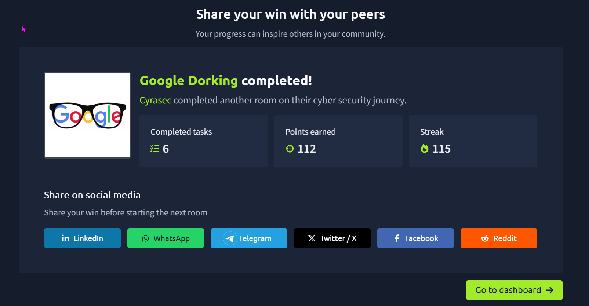

# 🔎 Google Dorking

<p align="center">
  
</p>

<p align="center">
  
  
  
</p>

---

## 🎯 Room Overview

**Google Dorking** is a TryHackMe room focused on using search engines more effectively for cybersecurity research and reconnaissance.

The room explores how search engines crawl and index websites, how website owners control crawler access, and how advanced search operators can be used to narrow down publicly indexed information.

🔗 **TryHackMe Room:**  
https://tryhackme.com/room/googledorking

---

## 🧠 What I Learned

Through this room, I learned:

- 🔎 How search engines work
- 🕷️ How web crawlers discover and index content
- 📊 Basics of Search Engine Optimisation (SEO)
- 🤖 How `robots.txt` controls crawler behaviour
- 🗺️ How `sitemap.xml` helps crawlers discover website content
- 🔍 How Google advanced search operators work
- 🧩 How multiple search operators can be combined
- 🕵️ Using Google Dorking as an OSINT and reconnaissance technique
- ⚠️ The importance of responsible and authorised security research

---

# 🕷️ 1. Search Engines & Crawlers

Search engines use automated programs known as **crawlers** or **spiders** to discover and collect information from websites.

A crawler can:

```text
Discover URLs
      ↓
Visit Web Pages
      ↓
Collect Resources
      ↓
Process Content
      ↓
Index Information
      ↓
Return Search Results
```

Understanding this process helps security researchers understand what information may already be publicly indexed.

---

# 🤖 2. Robots.txt

`robots.txt` is commonly located at:

```text
https://example.com/robots.txt
```

It provides instructions to web crawlers about which areas of a website they should or should not crawl.

### Example

```text
User-agent: *
Disallow: /private/
```

This tells compliant crawlers not to crawl the `/private/` path.

> ⚠️ Important: `robots.txt` is **not an access-control mechanism**. It should never be treated as a security boundary.

---

# 🗺️ 3. Sitemaps

A sitemap provides search engines with information about the structure and URLs of a website.

A common location is:

```text
https://example.com/sitemap.xml
```

Sitemaps are generally written in **XML** format.

### Why are they useful?

They can help crawlers discover pages more efficiently instead of relying only on following links.

---

# 🔍 4. Google Dorking

Google Dorking, also called **Google Hacking**, is the use of advanced search operators to refine search results.

Instead of performing a broad search like:

```text
cybersecurity
```

we can narrow results using operators.

---

## 🧰 Important Google Operators

| Operator | Purpose | Example |
|---|---|---|
| `site:` | Search within a specific domain | `site:example.com` |
| `filetype:` | Search for a specific file type | `filetype:pdf` |
| `intitle:` | Search words appearing in page titles | `intitle:login` |
| `inurl:` | Search words appearing in URLs | `inurl:admin` |
| `" "` | Search for an exact phrase | `"incident response"` |
| `-` | Exclude a term | `cybersecurity -jobs` |

---

# 🎯 5. Query Refinement

One of the most useful lessons from this room was that search queries can be progressively refined.

### Broad search

```text
GCHQ news
```

### Restrict the search to a domain

```text
site:bbc.co.uk GCHQ news
```

### Search for a particular file type

```text
site:bbc.co.uk filetype:pdf
```

This reduces irrelevant results and helps locate specific publicly indexed content.

---

# 📄 6. File Type Searching

The `filetype:` operator can be used to search for specific file formats.

Example:

```text
site:example.com filetype:pdf
```

Other file types can also be searched depending on the investigation.

### Security Perspective

Publicly indexed documents can sometimes reveal:

- Documentation
- Reports
- Technical information
- Metadata
- Old resources
- Publicly exposed configuration information

The key lesson is to understand **what information is publicly discoverable** and how organisations can reduce accidental exposure.

---

# 🧭 7. Reconnaissance & OSINT

Google Dorking can be useful during the **reconnaissance** phase of security assessments.

A simplified workflow:

```text
Target
  ↓
Passive Reconnaissance
  ↓
Search Engine Research
  ↓
Google Dorking
  ↓
Public Information Discovery
  ↓
Organise Findings
  ↓
Security Assessment
```

Google Dorking is especially useful because it works with information that search engines have already indexed.

---

# 🛡️ 8. Blue Team Perspective

As someone working towards **SOC / Blue Team**, I found this room especially useful because Google Dorking isn't only relevant to offensive security.

Defenders can use similar techniques to identify their organisation's potential public exposure.

### Defensive use cases

🔹 Identify accidentally indexed documents

🔹 Find exposed login portals

🔹 Discover old public-facing resources

🔹 Check for unintended information disclosure

🔹 Review the organisation's external footprint

🔹 Improve security awareness

---

# ⚠️ Responsible Use

Google Dorking itself searches publicly indexed information, but **what you do with the information matters**.

I will use these techniques only for:

- ✅ TryHackMe labs
- ✅ CTFs
- ✅ Authorised security assessments
- ✅ My own systems
- ✅ Security research where permission exists

I will not use discovered information to access systems without authorisation.

---

# 🧪 Practical Examples

### Search a specific domain

```text
site:example.com cybersecurity
```

### Search for PDFs

```text
site:example.com filetype:pdf
```

### Search for login-related pages

```text
site:example.com inurl:login
```

### Search page titles

```text
site:example.com intitle:login
```

### Combine operators

```text
site:example.com filetype:pdf "security"
```

These examples demonstrate the concept of query refinement without targeting systems without permission.

---

# 💡 Key Takeaways

> **The better you understand how search engines index information, the better you become at finding relevant information during reconnaissance.**

### My main takeaways:

🧠 Search engines contain far more information than ordinary searches reveal.

🕷️ Crawlers are responsible for discovering and collecting web resources.

🤖 `robots.txt` can provide crawler instructions but should not be considered a security control.

🗺️ `sitemap.xml` helps crawlers discover website content.

🔎 Search operators allow highly targeted queries.

🛡️ Google Dorking can also be useful from a defensive perspective when checking an organisation's public exposure.

---

# 🏆 TryHackMe Completion

<p align="center">

### ✅ Google Dorking — Completed

**Platform:** TryHackMe  
**Category:** OSINT / Reconnaissance  
**Status:** Completed

</p>

---

# 📸 Proof of Completion

<p align="center">
  
</p>

---

# 📚 Skills Added

```text
OSINT
Reconnaissance
Google Advanced Search
Search Engine Research
Web Crawling Concepts
robots.txt
Sitemaps
Information Discovery
Security Awareness
```

---

<p align="center">

💙 **Blue Team | SOC | OSINT | Threat Hunting**

</p>

<p align="center">
  <i>Learning • Practicing • Documenting • Improving</i>
</p>
