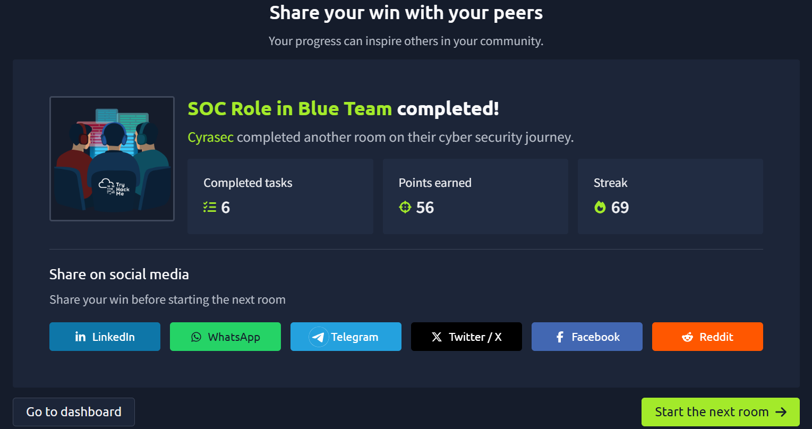

# SOC Role in Blue Team

## Overview

This room introduced the different roles within a Security Operations Center (SOC) and explained how security teams work together to detect, investigate, and respond to cyber threats.

Status: ✅ Completed

---

## What I Learned

- Structure of a Security Operations Center (SOC)
- Responsibilities of L1, L2, and L3 Analysts
- Threat Hunting Concepts
- Digital Forensics Basics
- Incident Response Workflow
- Security Monitoring Operations
- Collaboration within Blue Team

---

## Key Concepts

### L1 Analyst
- Monitors alerts
- Performs initial investigation
- Escalates incidents

### L2 Analyst
- Conducts deeper analysis
- Validates threats
- Handles incident investigations

### L3 Analyst
- Advanced threat hunting
- Malware analysis
- Security engineering

### Incident Response
- Identification
- Containment
- Eradication
- Recovery
- Lessons Learned

---

## Skills Gained

- SOC Operations Understanding
- Alert Investigation
- Incident Response Awareness
- Threat Hunting Concepts
- Blue Team Methodology

---

## Outcome

This room helped me understand how a Security Operations Center operates and how different analyst levels contribute to defending an organization.

---

## Completion Proof

