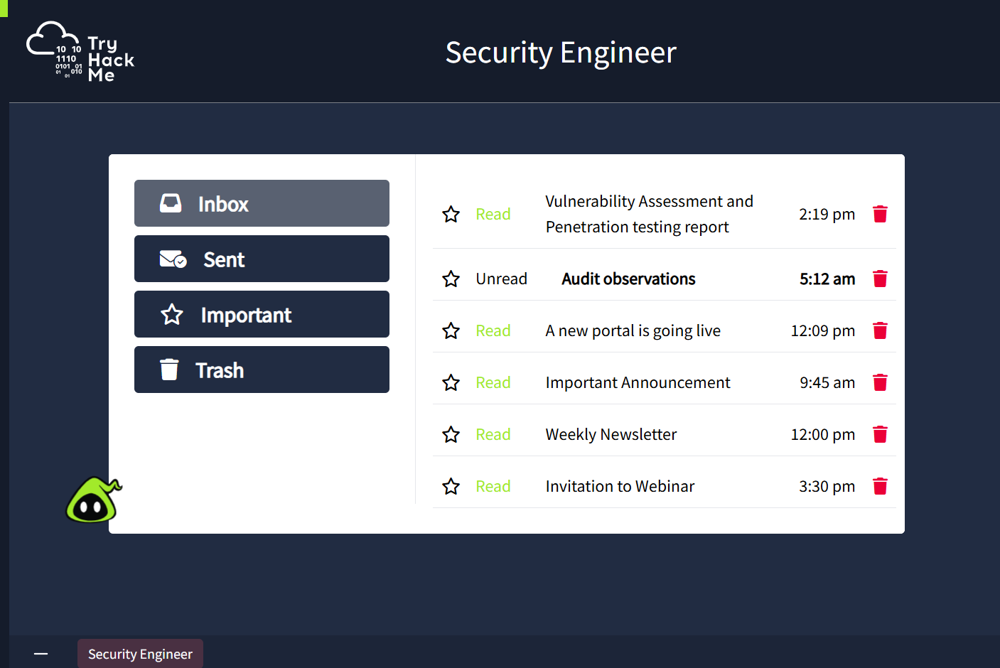

# Introduction to Security Engineering

## Overview

This room introduced the fundamentals of Security Engineering and explained how Security Engineers help organizations build, maintain, and improve secure systems. It also highlighted their collaboration with SOC Analysts, developers, and IT teams to proactively defend against cyber threats.

**Status:** ✅ Completed

---

## Objectives

- Understand the role of a Security Engineer
- Learn the core responsibilities of Security Engineering
- Explore vulnerability management and risk assessment
- Understand continuous security improvement
- Experience real-world Security Engineer workflows

---

## What I Learned

- Responsibilities of a Security Engineer
- Security-by-Design principles
- Risk Assessment
- Vulnerability Assessment
- Patch Management
- Security Monitoring
- Security Architecture
- Continuous Security Improvement
- Collaboration with SOC and IT teams

---

## Core Responsibilities

### 🛡 Security Architecture
Design secure applications, networks, and infrastructure.

### 🔍 Vulnerability Management
Identify, assess, prioritize, and remediate vulnerabilities before attackers exploit them.

### 📊 Risk Assessment
Analyze risks and recommend appropriate security controls.

### 📈 Continuous Improvement
Continuously improve organizational security by reviewing incidents, audits, and new threats.

### 🤝 Collaboration
Work closely with SOC Analysts, System Administrators, Developers, and Management to improve overall security posture.

---

## Practical Activities

During this room I explored several practical Security Engineering tasks, including:

- Reviewed vulnerability assessment reports
- Analyzed penetration testing findings
- Studied audit observations
- Evaluated security recommendations
- Completed a practical vulnerability remediation scenario
- Learned how Security Engineers prioritize and resolve vulnerabilities

---

## Skills Gained

- Security Engineering Fundamentals
- Vulnerability Assessment
- Patch Management
- Risk Management
- Security Documentation
- Security Operations Workflow
- Defensive Security Concepts

---

## Interview Questions I Can Answer

- What does a Security Engineer do?
- What is Vulnerability Management?
- What is Risk Assessment?
- What is Patch Management?
- What is the difference between a Security Engineer and a SOC Analyst?
- Why is continuous security improvement important?

---

## Key Takeaway

A Security Engineer focuses on preventing cyber attacks by designing secure systems, identifying vulnerabilities, implementing security controls, and continuously improving an organization's security posture. This proactive approach complements the work of SOC Analysts, who primarily detect and respond to security incidents.

---

## Practical Evidence

### ✅ Room Completion

### 🔍 Vulnerability Assessment Exercise

### 📧 Security Engineer Workflow

